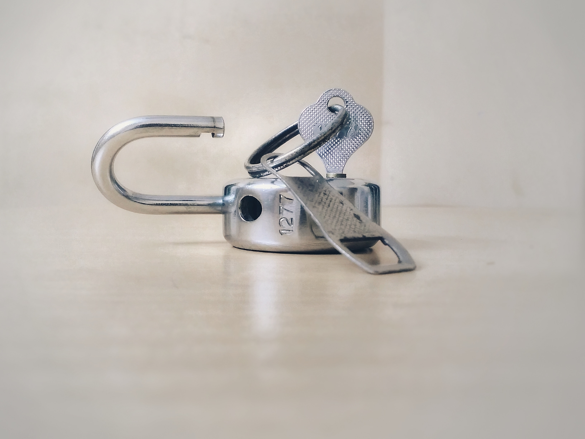

# Class 05 reading notes

#### [HOME](https://cesarderio.github.io/reading-notes/)

## Installing Virtualbox with Linux Terminal

The resources and tutorials below offer a great insight into the background and basic concepts to get someone up and running with working with the command line interface.

## Reading

[Linux command line for beginner:](https://ubuntu.com/tutorials/command-line-for-beginners#1-overview) Read parts 1-3. The rest is a how-to guide; skim as time allows.

Explain the terms “shell”, “terminal”, “cli”, and “command prompt”. Why are these still used today, when we have graphical interfaces?

* **shell** - Command line interpreter. It provides an interface between user <-> kernel to execute commands.

* **terminal** - similar to shell, interface for user text input.

* **cli** - shell, bash, etc. are **command line interface(s)**

* **command prompt** - user input to execute commands.

What are the commands to change directories, list the file’s contents and rename/move files?

  Each of these tasks required its own program or command: one to change directories (cd), another to list their contents (ls), a third to rename or move files (mv), and so on.

* **cd** - change directory

* **ls** - list contents of current directory

* **mv** - move or rename files

What are relative and absolute paths? What is special about starting with a ~ (tilde) or a ‘/’ character in the path?

* **absolute path** is always pointing to the same location/resource. **relative path** points to a location from current working directory/location.

Explain what Linux is, using anything except English.

#### Things I want to know more about
