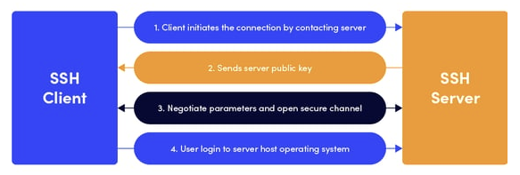

# Class 07 reading notes

#### [HOME](https://cesarderio.github.io/reading-notes/)

## Network Connectivity

Below is a good start on learning and understanding what **SSH** Protocol and Window's **R**emote **D**esktop connection **P**rotocol are all about and how they work.

## Reading

[SSH Protocol](https://www.ssh.com/ssh/protocol/)

What is the Secure Shell (SSH) Protocol?

* Method for secure remote login from one computer to another computer.

What are the typical uses of the SSH protocol?

* Providing secure access for users and automated processes

* Interactive and automated file transfers

* Issuing remote commands

* Managing network infrastructure and other mission-critical system components.

How does the SSH protocol work?

* [The protocol works in the client-server model, which means that the connection is established by the SSH client connecting to the SSH server. The SSH client drives the connection setup process and uses public key cryptography to verify the identity of the SSH server. After the setup phase the SSH protocol uses strong symmetric encryption and hashing algorithms to ensure the privacy and integrity of the data that is exchanged between the client and server.](https://www.ssh.com/academy/ssh/protocol#:~:text=The%20protocol%20works,client%20and%20server.)

[Example:](https://www.ssh.com/ssh/protocol/)

How is the data kept safe when transmitted between the SSH client and server?

* The data is encrypted with a SSH key established at the time of setup.

What is SFTP?

* SSH File Transfer Protocol

[What is RDP? And how to use it](https://www.comparitech.com/net-admin/what-is-rdp/)

What is Windows Remote Desktop Connection?

* It is a program/tool to remotely connect to a Windows machine/server over the internet or local network.

What is RDP?

* **Remote Desktop Protocol** allows remote users to see/use Windows on a different machine.

What is the RDP port number?

* 3389

#### Things I want to know more about
