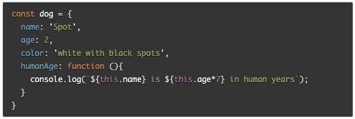

# Class 6 reading notes

### JavaScript Object Basics:

How would you describe an object to a non-technical friend you grew up with?

* A grouping of like-minded ideas and set of directions, like a children's book for children for example.

What are some advantages to creating object literals?

* It can make it easier to debug, less chances of issues with scope and much better to reuse and move around in the code.

How do objects differ from arrays?

* Arrays are objects that store data and can be accessed by their index, an object is not always an array and they can hold anything except **undefined**, they can be accessed in multiple ways and change other objects as well.

Give an example for when you would need to use bracket notation to access an object’s property instead of dot notation.

* IUf a property name is defined at runtime.

Evaluate the code below. What does the term **this** refer to and what is the advantage to using **this**?

* signifies the current object it is inside of. It is an advantage when there are multiple objects and you can use it in each instance inside the object instead of making new keywords for each.

### Introduction To The DOM:

What is the DOM?

* It is an interface for web docs, it is known as the Document Object Model, i.e. DOM.

Briefly describe the relationship between the DOM and JavaScript.

* The DOM represents the page, it can change the look, structure and how the content is shown or works.
