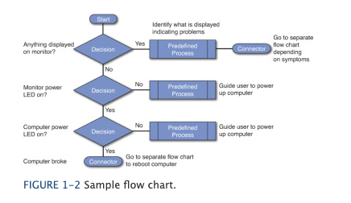

# Class 03 reading notes

#### [HOME](https://cesarderio.github.io/reading-notes/)

## Issue tracking system

Below you will find some reading materials and additional resources that support today’s topic and the upcoming lecture. This article talks a bit about **Help Desk Support Roles** and some of what is involved. I have linked some material I found to be important and an example image of a flow chart a technician might use on the job.

## Reading

[Introduction to Help Desk Support Roles](https://www.pearsonitcertification.com/articles/article.aspx?p=2260779&seqNum=5)

* [The help desk professional is often the “face” of the IT staff that customers see and, right or wrong, customers often make judgments about the entire organization based on their interactions with a help desk professional.](https://www.pearsonitcertification.com/articles/article.aspx?p=2260779&seqNum=5#:~:text=The%20help%20desk%20professional%20is%20often%20the%20%E2%80%9Cface%E2%80%9D%20of%20the%20IT%20staff%20that%20customers%20see%20and%2C%20right%20or%20wrong%2C%20customers%20often%20make%20judgments%20about%20the%20entire%20organization%20based%20on%20their%20interactions%20with%20a%20help%20desk%20professional.)

* Usually the "first line" or first level of support. This is where we go thru all the basic documentation of the issues/problem, troubleshooting, any more detail or information, steps we took, etc..

* **Soft skills**
  * Communication skills
  * Personal skills
  * Writing skills
  * Training skills

  * Critical thinking
    * Actively thinking
    * Asking
    * Changing perspectives
    * Evaluating evidence or symptoms

* **Hard skills**
  * Technical skills
  * Security skills
  * Troubleshooting skills
  * Business skills

[Example flow chart](javascript:popUp('/content/images/chap1_9780789752406/elementLinks/01fig02_alt.jpg'))

### Things I want to know more about
