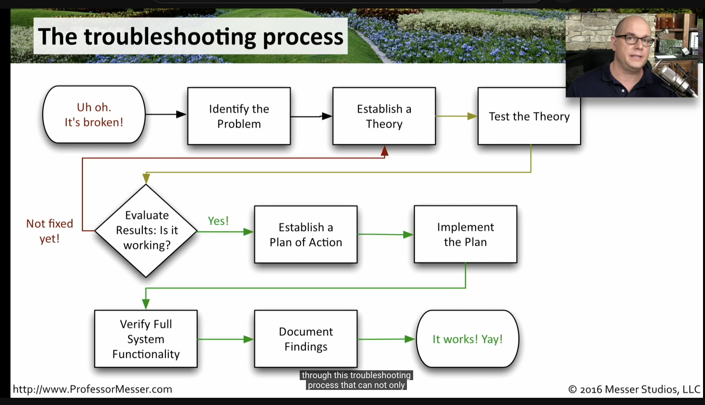

# Class 04 reading notes

#### [HOME](https://cesarderio.github.io/reading-notes/)

## Troubleshooting Techniques

Below you will find some reading materials and additional resources that support today’s topic and the upcoming lecture.

## Reading

[CompTIA A+ 220-902 Troubleshooting Methodology](https://www.professormesser.com/free-a-plus-training/220-902/how-to-troubleshoot/)

* Identify the Problem
* Establish a Theory
* Test the Theory
* Evaluate Results (is it working?)
* Establish Plan of Action
* Implement Plan
* Verify full system functionality
* Document findings

* Information gathering
  * get details
  * can you duplicate the issue?

* Identify symptoms
  * there may be more than one symptom

* List all possible problems.

* Test, test again

### Things I want to know more about
