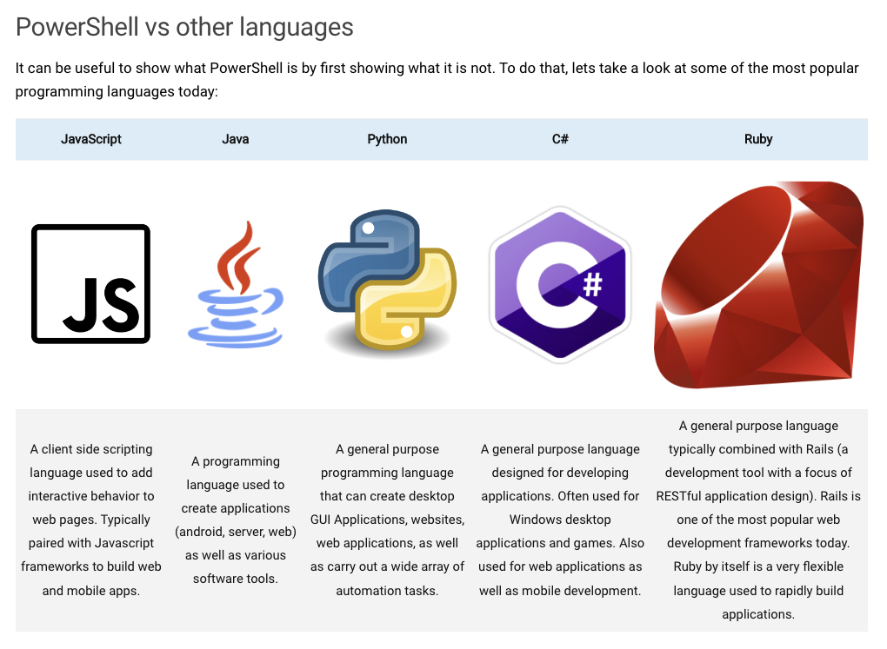

# Class 07 reading notes

#### [HOME](https://cesarderio.github.io/reading-notes/)

## OS Upgrade and Remote Access

Below you will find some reading material, code samples, and some additional resources that support today’s topic and the upcoming lecture.

## Reading

[Should You Learn Powershell?](https://techthoughts.info/ps1-should-you-learn-powershell/)

What is **Powershell?**

* Application/program made by Microsoft

* A command-line shell interface

* Enables computer management from the command line for system administrators(and power users)

* A scripting language, build on **[.NET](https://dotnet.microsoft.com/en-us/learn/dotnet/what-is-dotnet)

* Can be used for automating administrative tasks and configuration management.

[PowerShell is an interpreted language for doing things, typically in the context of managing a technology environment. A developer will develop an application in C#, but that application might run on a fleet of servers, or native cloud technology that an engineer deploys and manages with PowerShell.](https://www.techthoughts.info/ps1-should-you-learn-powershell/#:~:text=PowerShell%20is%20an%20interpreted%20language%20for%20doing%20things%2C%20typically%20in%20the%20context%20of%20managing%20a%20technology%20environment.%20A%20developer%20will%20develop%20an%20application%20in%20C%23%2C%20but%20that%20application%20might%20run%20on%20a%20fleet%20of%20servers%2C%20or%20native%20cloud%20technology%20that%20an%20engineer%20deploys%20and%20manages%20with%20PowerShell.)

[Who needs malware? IBM says most hackers just Powershell through boxes now, leaving little in the way of footprints](https://www.theregister.com/2019/02/26/malware_ibm_powershell/)

* 

*

*

## Videos

[What is a Powershell attack?](https://www.youtube.com/watch?v=fe5Mbszdu9M)

## Bookmark and Review

[Microsoft Documentation: What is PowerShell?](https://docs.microsoft.com/en-us/powershell/scripting/overview?view=powershell-7)

[Microsoft Documentation: Getting Started with PowerShell](https://docs.microsoft.com/en-us/powershell/scripting/learn/ps101/01-getting-started?view=powershell-7)

[Quick Reference - Powershell Variables and Operators](https://ss64.com/ps/syntax-variables.html)

### Things I want to know more about
