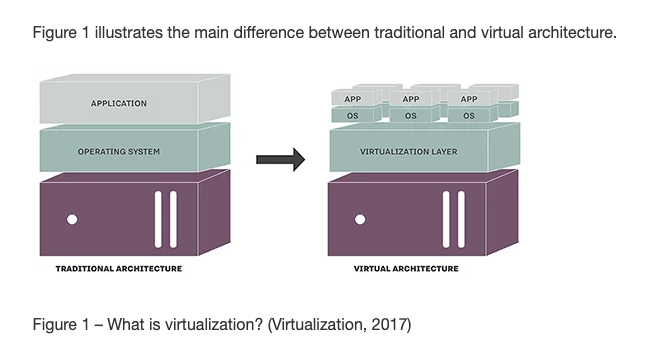
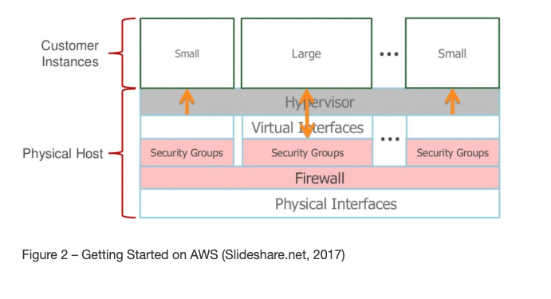
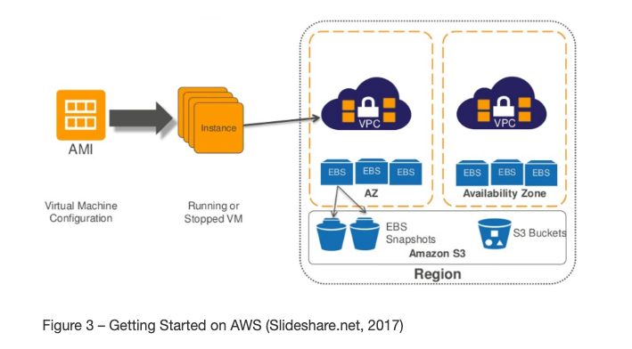
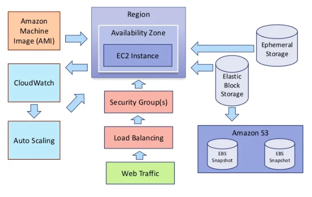

# Class 13 reading notes

#### [HOME](https://cesarderio.github.io/reading-notes/)

## Cloud Virtualization with AWS

Below you will find some reading material, code samples, and some additional resources that support today’s topic and the upcoming lecture.

## Reading

[Importance of Virtualization in the Amazon EC2 Cloud](https://www.joe0.com/2017/06/11/importance-of-virtualization-in-the-amazon-ec2-cloud/)

* *“Virtualization is the creation of a virtual, rather than actual, version of something.”* -Tech Target (2017)

* **Amazon IaaS cloud service model** is characterized by delivering virtualized computer infrastructure in the form of a service (**I**nformation **a**s **a** **Service**)
  * Amazon Elastic Compute Cloud (EC2)

[The diagram in Figure 2 shows the architecture of EC2 host virtualization. The diagram also shows the crucial role that hypervisor in virtualization itself. It acts as a virtual machine manager that sits on top of the host system where all of the customer virtual machines run. “The relationship of the hypervisor to the host operating system and to the virtual machine is one of the key distinguishing characteristics of the different virtualization systems.” (Amies, Sluiman, and Tong, 2017).](https://www.joe0.com/2017/06/11/importance-of-virtualization-in-the-amazon-ec2-cloud/#:~:text=The%20diagram%20in,and%20Tong%2C%202017).)

[Another critical part of the entire process of virtualization in Amazon EC2 is Amazon Machine Image (AMI), which is also a virtual appliance. However, AMI is mainly responsible for creating on-demand virtual machines within the Amazon Elastic Compute Cloud. The diagram (Figure 3) is an illustration of the importance of Amazon AMI in the process of VM creation in Amazon EC2 and also shows how it generates the various EC2 instances on demand.](https://www.joe0.com/2017/06/11/importance-of-virtualization-in-the-amazon-ec2-cloud/#:~:text=Another%20critical%20part,instances%20on%20demand.)

[To tie all the knots, the diagram in Figure 4 demonstrates the high-level architecture of Amazon EC2 and the relation of EC2 instances to availability zones in various regions. We can also see how EC2 instances use the storage through either Ephemeral (temporary) or Elastic Block Storage snapshots stored in Amazon S3; and observe how CloudWatch monitors AWS cloud resources and how EC2 web traffic is load balanced as well as how it passes trough various security rules.](https://www.joe0.com/2017/06/11/importance-of-virtualization-in-the-amazon-ec2-cloud/#:~:text=To%20tie%20all,various%20security%20rules.)

## Video

[AWS Cloud Practitioner Essentials (Second Edition): AWS Core Services](https://www.aws.training/Details/eLearning?id=29700)

* EC2 Video Only

## Bookmark and Review

[Privileged Access Cloud Security for Dummies](https://www.dummies.com/wp-content/uploads/Privileged-Access-Cloud-Security-For-Dummies-Thycotic-Special-Edition.pdf)

Be sure to read this article to be prepared for our in-class discussion in Class 14:

[What Google Learned From Its Quest to Build the Perfect Team](https://www.google.com/amp/mobile.nytimes.com/2016/02/28/magazine/what-google-learned-from-its-quest-to-build-the-perfect-team.amp.html)

### Things I want to know more about
