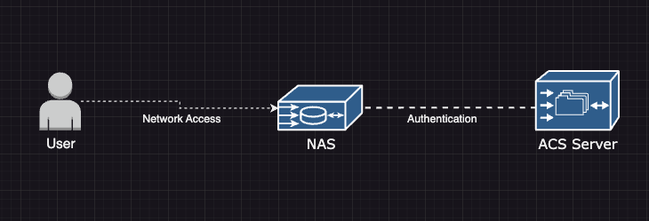

# Class 08 reading notes

#### [HOME](https://cesarderio.github.io/reading-notes/)

## RADIUS Authentication

The linked content is a good resource for learning about what RADIUS Authentication

## Reading

## [Computer Network - AAA (Authentication, Authorization and Accounting)](https://www.geeksforgeeks.org/computer-network-aaa-authentication-authorization-and-accounting/)

Explain each of the three A’s as you would to a non-technical family member. Use an analogy or a story.

* Authentication - You are who you say you are
  * Someone shows their ID at a restaurant to get an adult beverage.

* Authorization - (what)You are allowed to be/see/do depending on context.
  * The bouncer kicks someone out of the bar for being underage.

* Accounting - Track who, what, where, when.
  * The bouncer and hostess help the assistant manager with keeping track of the customer traffic throughout the shift.

What should the administrator do if the ACS server fails to authenticate a user during AAA implementation?

* [If the ACS server fails to authenticate, the administrator should mention using the local database of the device as a backup, in the method list, to implement AAA.](https://www.geeksforgeeks.org/computer-network-aaa-authentication-authorization-and-accounting/#:~:text=If%20the%20ACS%20server%20fails%20to%20authenticate%2C%20the%20administrator%20should%20mention%20using%20the%20local%20database%20of%20the%20device%20as%20a%20backup%2C%20in%20the%20method%20list%2C%20to%20implement%20AAA.)

What is the role of the NAS in the AAA implementation using an ACS server? Use a diagram.

* **Network Access Server** is a middleman that handles authentication requests and controls what the user can access on the internet.

[RADIUS Concepts](https://archive.is/27Y19)

What are the benefits of using RADIUS for authentication and authorization?

* Centralized Authentication and Authorization.

* Integration with AAA services all in one place.

* Scalability and growth.

What is RADIUS and what does it stand for?

* **Remote Authentication Dial-In User Service** is a network(ing) protocol. It runs as a layer to take care of AAA services between integration and controlling who, what, where, how all in one place.

Research: What encryption algorithms does RADIUS use?

* **CHAP** Challenge-Handshake Authentication Protocol

* **TLS** Transport Layer Security

* **PEAP** Protected Extensible Authentication Protocol

## Videos

[Authentication Methods](https://www.professormesser.com/network-plus/n10-008/n10-008-video/authentication-methods-n10-008/)

[Defense in Depth](https://www.professormesser.com/network-plus/n10-008/n10-008-video/defense-in-depth-n10-008/)

[RADIUS and TACACS](https://www.professormesser.com/security-plus/sy0-401/radius-and-tacacs-2/)

[Kerberos](https://www.professormesser.com/security-plus/sy0-401/kerberos-2/)

### Things I want to know more about
