# Class SQL reading notes

#### [HOME](https://cesarderio.github.io/reading-notes/)

#### [Learn SQL](https://cdn2.hubspot.net/hubfs/392937/Learn%20SQL.pdf?utm_referrer=https%3A%2F%2Flanding.chartio.com%2Fdownload-learn-sql)

Relational Databases and SQL

SQL stands for **Structured Query Language**

* It is a search language to tell the database what information you are looking to request from the database.

* Databases organize data in different tables.

### **Commands**

* **SELECT** is a basic command when fetching data from a database using a query.

* **FROM** keyword is used to tell "where" we want to gather the information from /(what comlumn/table/location).

* **Splat** is the *, which is a shortcut to fetch all information from all columns.

* **ORDER BY** is the command for how to sort the information/query response.

* **ASC** & **DESC** are the commands to sort in ascending order or descending order.(Year, age, alphabetical, etc.).

* **LIMIT** is the command to limit how many results/rows are returned.

* **OFFSET** is the command to specify "from where" to start returning the data. (i.e. request top 3 movies, starting at number 2 would return 3, 4, 5).

### SCHEMA

* Used to describe collection of tables and relationships in the database.

* **WHERE** is a command to filter by using conditions.

* **Conditions** are statements that will be true or false when compared to data.

* **AND** command to add more than one conditional.

* **OR** command to match at least one conditional.

* **NOT** command to change it to !=.

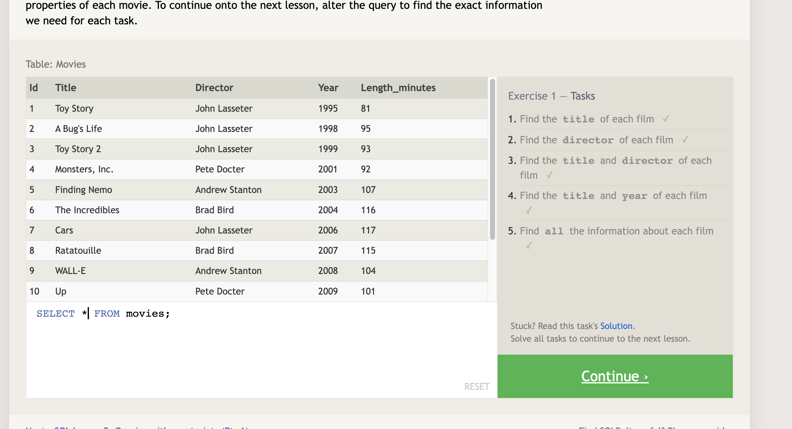
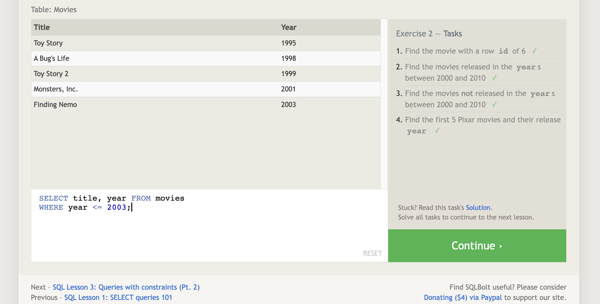
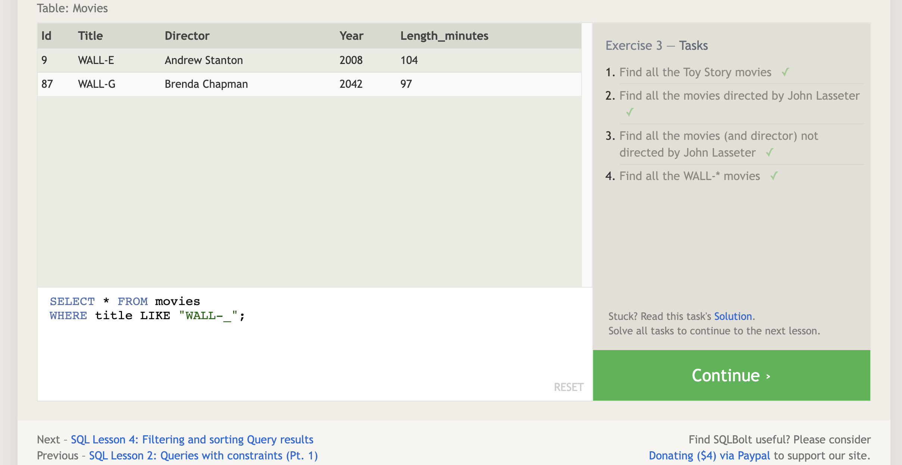
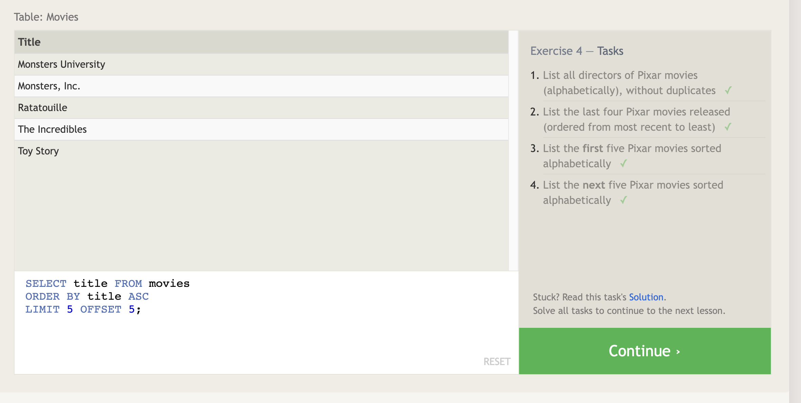
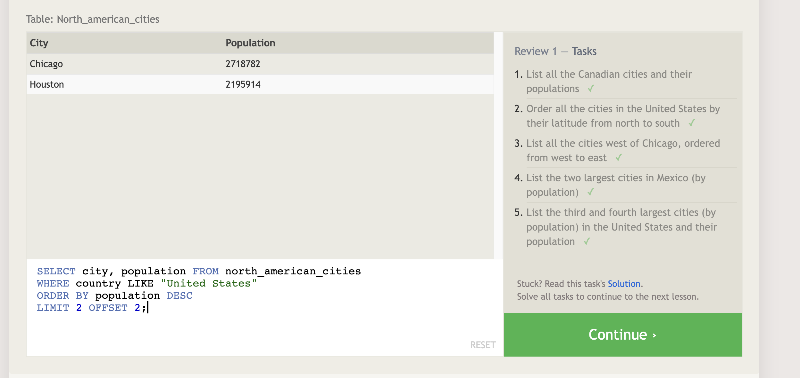
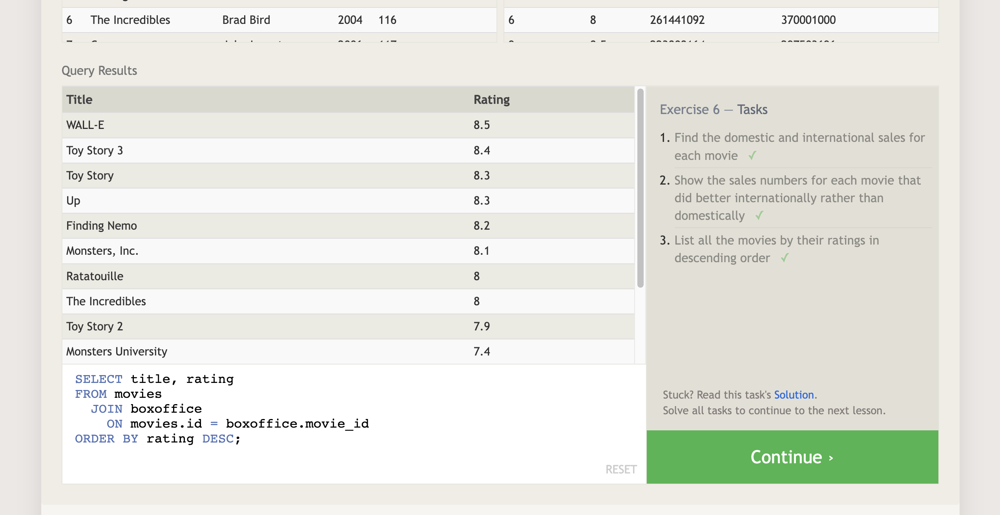

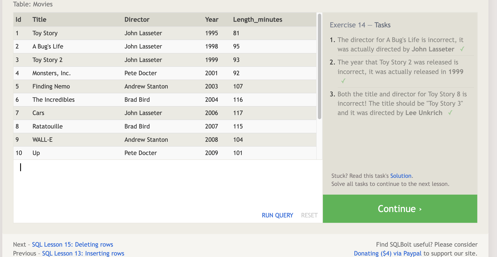
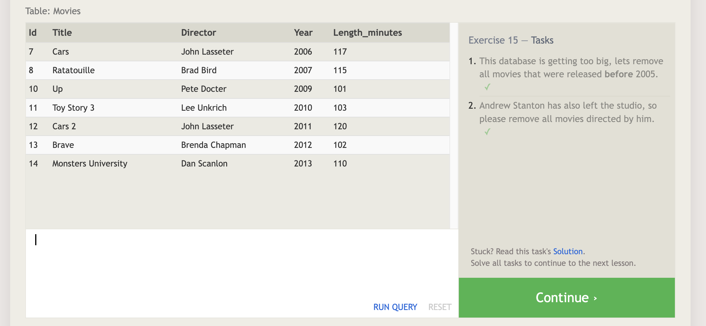
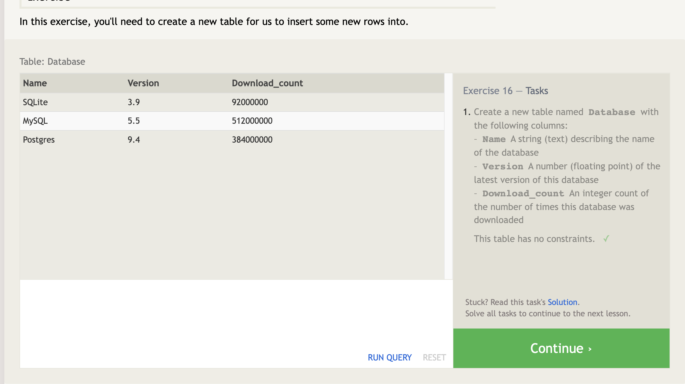
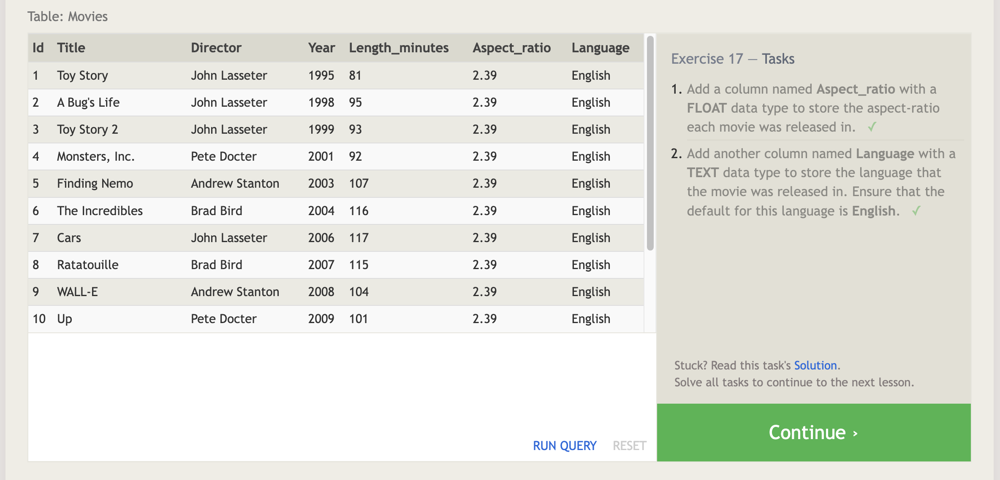
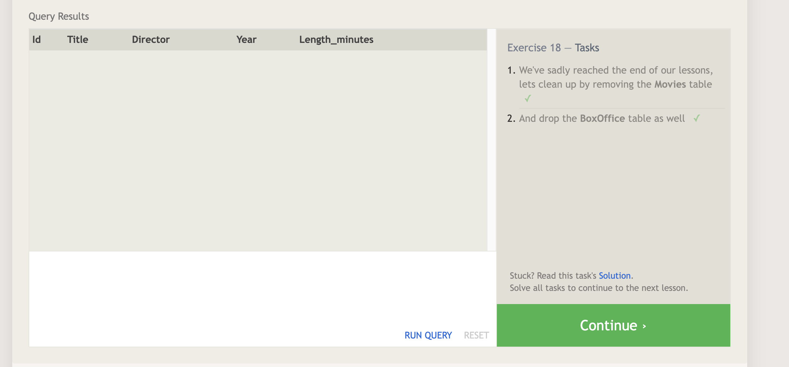
