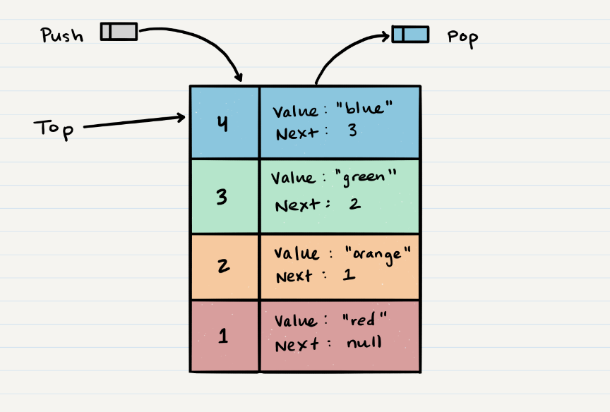
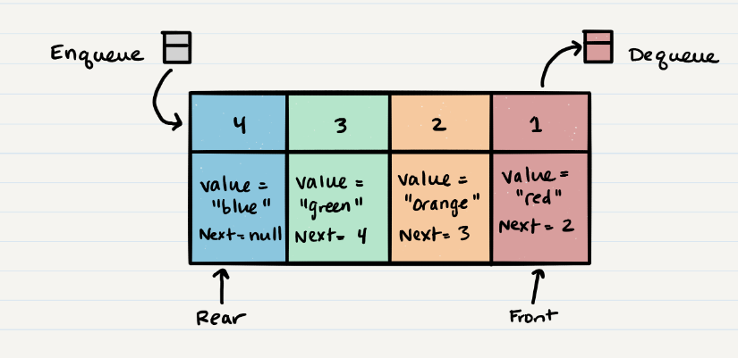

# Class 10 reading notes / Stacks and Queues

#### [HOME](https://cesarderio.github.io/reading-notes/)

### Stack

A stack is a data stucture that consists of Nodes. ( A stack of Nodes).

### Common stack terms

**PUSH** - Nodes that are put into the *stack* are "pushed" into the *stack*.

**POP** - Nodes removed from the *stack* are "popped" off the *stack*.

**TOP** - Top of the *stack*.

**PEEK** - You can "peek" at the value of the *HEAD*/top Node in the *stack*.

**isEmpty** - If the stack is empty it returns *true*, otherwise *false*.

**FILO** - **F**irst **I**n **L**ast **O**ut.

**LIFO** - **L**ast **I**n **F**irst **O**ut.

#### Visualization

### Queue

### Common Queue terms

**Enqueue** - Nodes or items that are added to the queue.

**Dequeue** - Nodes or items that are removed from the queue. If called when the queue is empty an exception will be raised.

**Front** - This is the front/first Node of the queue.

**Rear** - This is the rear/last Node of the queue.

**Peek** - When you peek you will view the value of the front Node in the queue. If called when the queue is empty an exception will be raised.

**IsEmpty** - returns true when queue is empty otherwise returns false.

**FIFO** - First In First Out
  The first item in the queue will be the first item out of the queue.

**LILO** - Last In Last Out
  This means that the last item in the queue will be the last item out of the queue.

#### Visualization

