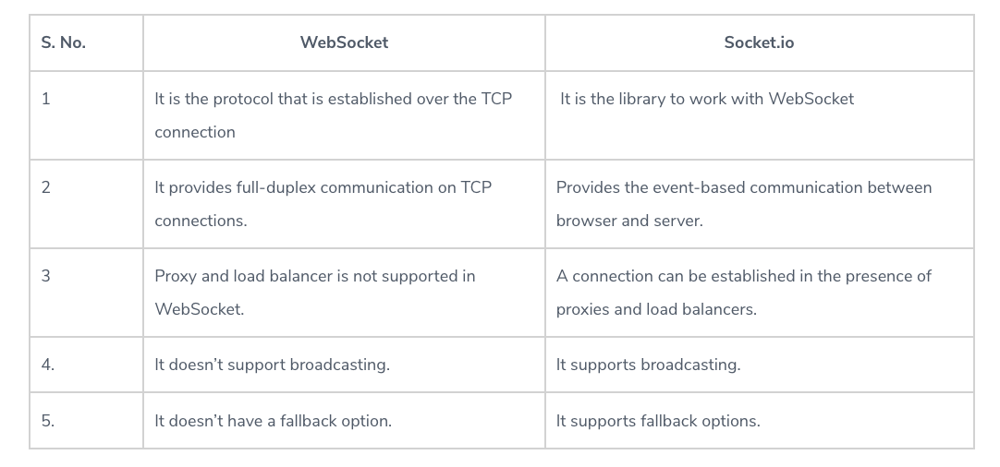
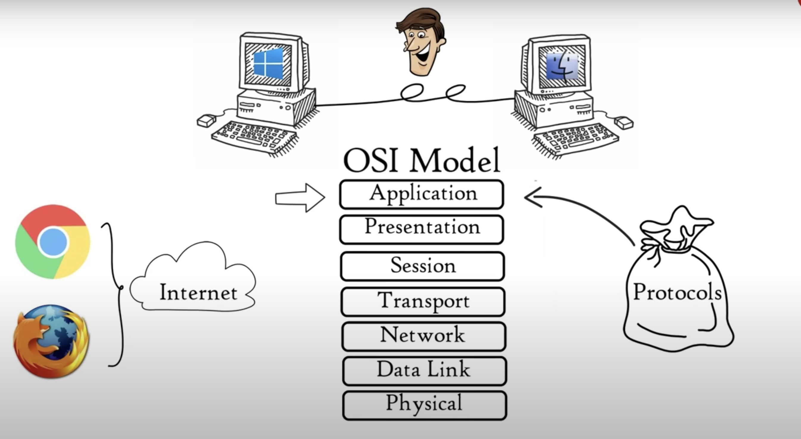

# Class 12 reading notes

#### [HOME](https://cesarderio.github.io/reading-notes/)

## Socket.io

Below you will find some reading material, code samples, and some additional resources that support today’s topic and the upcoming lecture.

## Reading

[Web Sockets](https://en.wikipedia.org/wiki/WebSocket)

What is a Web Socket?

* A Web Socket is a communications protocol which enables interaction between a web browser and a web server.

Describe the Web Socket request/response handshake and what happens once the connection is established.

* A client sends a WebSocket handshake request, the server then returns a WebSocket handshake response. Once the connection is established communication switches to a **bidirectional binary protocol**

Web Sockets provide a standardized way for the server to send content to a client without first receiving a ____ from that client.

* request

[Socket.io Tutorial](https://www.tutorialspoint.com/socket.io/)

What does the event handler **io.on()** do?

* **io.on** handles connection, disconnection, etc., events in it, using the socket object.

Describe some possible proof of life or proof that the code works as expected

* We will see our console logs, and inside console/terminal we will see **A user connected**. If browser is refreshed, it will disconnect from the socket and return console logs **A user disconnected** and **A user connected**

What does socket.emit() do?

* It sends/fires off an event from the client.

[Socket.io vs Web Sockets](https://www.educba.com/websocket-vs-socket-io/)

What is the difference between WebSocket and Socket.IO? (think Git and GitHub, or OAuth and Auth0).

* WebSocket is the protocol that provides communication between client and server. Socket.IO is a library that allows communication between the two, it uses WebSocket protocol for its interface.

When would you use Socket.IO?

* If there are procies and load balancers, Socket.io connection can be established, these are not supported in WebSocket.

When would you use WebSockets?

* When you need an open channel of communication between client and server to stay open. Ideally both would be used together to implement both of thier strengths and minimize the disadvantages of each.

## Videos

[OSI Model Explained](https://www.youtube.com/watch?v=vv4y_uOneC0)

What are a couple of key takeaways from this video?

* OSI Model

* The Application Layer is made up of many protocols that allow all different types of network services for user activities.

* The presenstation layer translates information, data compression, Encryption and Decryption.

* APIs work within the Session Layer. Authentication and Authorization are run in the Session Layer.

[TCP Handshakes Explained](https://www.youtube.com/watch?v=xMtP5ZB3wSk)

Translate the gist of this video to a non-technical friend

* TCP - Transmission Control Protocol - connection oriented transport protocol. It can be delivered successfully and accurately. Web, email and FTP.

* It uses a three way handshake to establish a connection.
* Step 1: client asks server to open a connection.
* Step 2: server acknowledges client's request to connect and asks client to open a connection
  too.
* Step 3: client replies with yes, two way connection is established.

## Bookmark and Review

[Socket.io Documentation](https://socket.io/docs/)

[Socket.io Server API](https://socket.io/docs/server-api)

[Socket.io Client API](https://socket.io/docs/client-api)

[Socket Testing Tool](https://amritb.github.io/socketio-client-tool/)

## Reflection

What are your learning goals after reading and reviewing the [class README?](https://codefellows.github.io/code-401-javascript-guide/curriculum/class-12/)

* My learning goals are to gain more understanding and confidence as well as practice with all topics we have learned so far.

## Things I want to know more about
