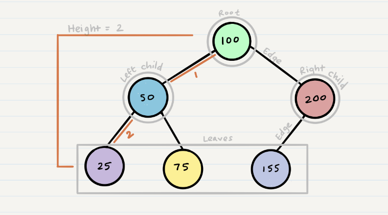

# Class 15 reading notes

#### [HOME](https://cesarderio.github.io/reading-notes/)

### [TREES](https://codefellows.github.io/common_curriculum/data_structures_and_algorithms/Code_401/class-15/resources/Trees.html)

### [Common Terminology](https://codefellows.github.io/common_curriculum/data_structures_and_algorithms/Code_401/class-15/resources/Trees.html#:~:text=Node%20%2D%20A%20Tree,the%20furthest%20leaf)

**Node** - A Tree node is a component which may contain its own values, and reference
  to other nodes

**Root - The root is the node at the beginning of the tree

**K** - A number that specifies the maximum number of children any node may have in a
  k-ary tree. In a binary tree, k = 2.

**Left** - A reference to one child node, in a binary tree

**Right** - A reference to the other child node, in a binary tree

**Edge** - The edge in a tree is the link between a parent and child node

**Leaf** - A leaf is a node that does not have any children

**Height** - The height of a tree is the number of edges from the root to the furthest
  leaf

#### Depth First traversal

[Depth first traversal is where we prioritize going through the depth (height) of the tree first. There are multiple ways to carry out depth first traversal, and each method changes the order in which we search/print the root. Here are three methods for depth first traversal:

Pre-order: root >> left >> right
In-order: left >> root >> right
Post-order: left >> right >> root](<https://codefellows.github.io/common_curriculum/data_structures_and_algorithms/Code_401/class-15/resources/Trees.html#:~:text=Depth%20first%20traversal,left%20%3E%3E%20right%20%3E%3E%20root>)

#### Breath First traversal

[Breadth first traversal iterates through the tree by going through each level of the tree node-by-node](https://codefellows.github.io/common_curriculum/data_structures_and_algorithms/Code_401/class-15/resources/Trees.html#:~:text=Breadth%20first%20traversal%20iterates%20through%20the%20tree%20by%20going%20through%20each%20level%20of%20the%20tree%20node%2Dby%2Dnode)
