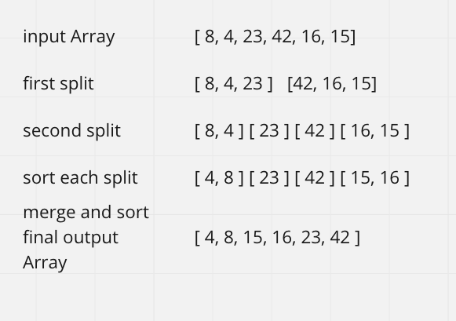

# Merge Sort

## Assignment

Review the pseudocode below, then trace the algorithm by stepping through the process with the provided sample array. Document your explanation by creating a blog article that shows the step-by-step output after each iteration through some sort of visual.

Once you are done with your article, code a working, tested implementation of Merge Sort based on the pseudocode provided.

### Pseudo Code

        ALGORITHM Mergesort(arr)
          DECLARE N <-- arr.length

          if n > 1
            DECLARE mid <-- n/2
            DECLARE left <-- arr[0...mid]
            DECLARE   RIGHT <-- ARR[mid...n]
            // sort the left side
            Mergesort(left)
            // sort the right side
            Mergesort(right)
            // merge the sorted left and right sides together
            Merge(left, right, arr)

        ALGORITHM Merge(left, right, arr)
          DECLARE i <-- 0
          DECLARE j <-- 0
          DECLARE k <-- 0

          while i < left.length && j < right.length
            if left[i] <= right[j]
                arr[k] <-- left[i]
                i <-- i + 1
            else
              arr[k] <-- right[j]
              j <-- j+1

            k <-- j + 1

          if i = left.length
            set remaining entries in arr to remaining values in right
          else
            set remaining entries in arr to remaining values in left

#### Sample Arrays

[ 8, 4, 23, 42, 16, 15]

##### Merge-Sort

* Merge Sort is an algorithm that continuously splits an array in half until it can not split it anymore. Once we are at the base case (can not split anymore) we can merge each split array. Once the sorting has completed on an array it can then merge the smaller split and sorted arrays back into one (larger)array.

