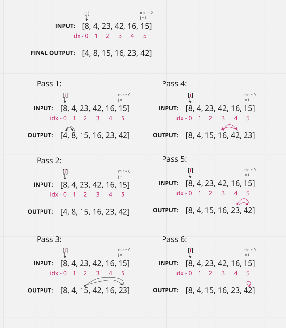

# Selection - Sort

#### [HOME](https://cesarderio.github.io/reading-notes/)

# Selection - Sort

Selection Sort is a sorting algorithm that traverses the array multiple times as it slowly builds out the sorting sequence. The traversal keeps track of the minimum value and places it in the front of the array which should be incrementally sorted.

;

### Pseudocode

        SelectionSort(int[], arr) => {
          let n = arr.length;
          for(i = 0; i = n - 1){
            let min = i;
            for(j = i + 1 to n){
              if(arr[j] < arr[min]){
              min = j;
              }
            }
            let temp = arr[min];
            arr[min] = arr[i];
            let arr[i] = temp;
          }
        }

## Approach & Efficiency

**Approach**

We first start with index 0 and traverse the array to check to see if there is a smaller number elsewhere inside the array. If there is, we swap with that smaller number replacing the larger number. If not, we move onto our next index at 1, and traverse the array to run the same check, if so swap, if not move onto the next index. We traverse and check for each index position. Once the function gets to the last number, there is no where else to go and the loops completes and returns the array now sorted correctly.

**Time: O(n^2)**

* The basic operation of this algorithm is comparison. This will happen n * (n-1) number of times…concluding the algorithm to be n squared.

**Space: O(1)**

* No additional space is being created. This array is being sorted in place…keeping the space at constant O(1).

### CODE

const arr = [8, 4 23, 42, 16, 15];

const selectionSort = arr => {
  const len = arr.length;

  //---- other option / example
  const swap = (arr, idx1, idx2) => {
    ([arr[idx1], idx[idx2]] = [arr[idx2], arr[idx1]]);
  }

  for(let i = 0; i < len; i++){
    let idxOfMin = i;

    for(let j = i + 1; j < len; j++){
      if(arr[j] < arr[idxOfMin]){
        idxOfMin = j;
      }
    }
    if(idxOfMin !== i){
      swap(arr, idxOfMin, i);
      //swap positions
      // const temp = arr[idxOfMin];
      // arr[idxOfMin] = arr[i];
      // arr[i] = temp;
    }
  }
  return arr;
}

selectionSort(arr);

console.log(arr);
