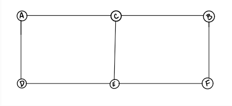
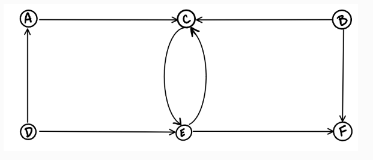
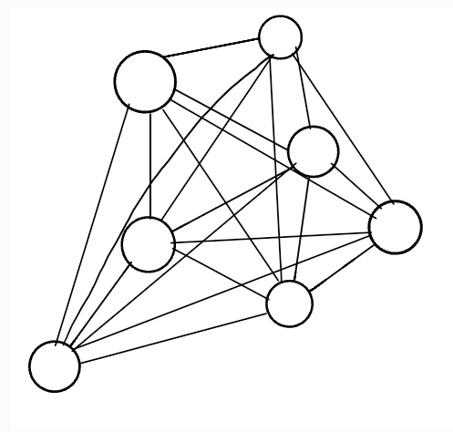
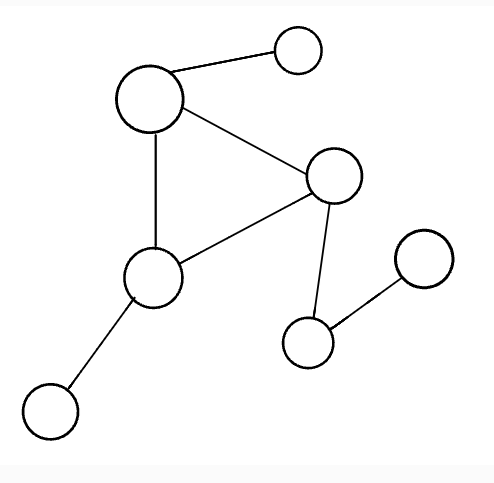
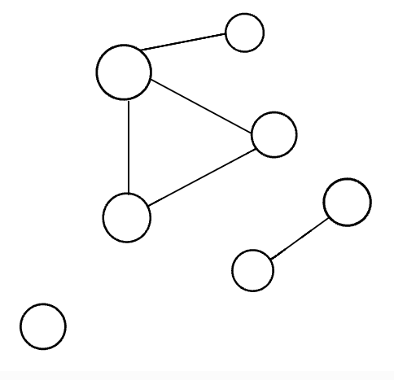
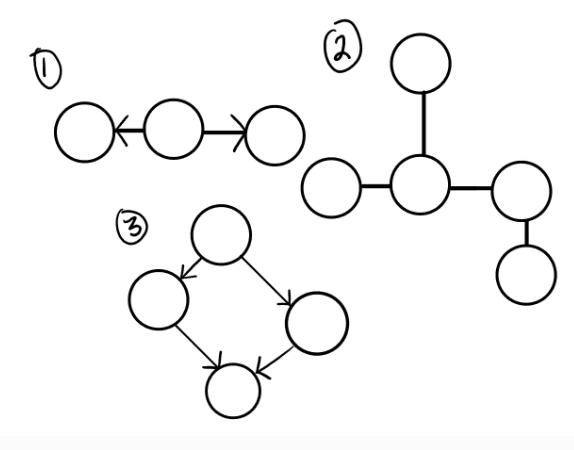
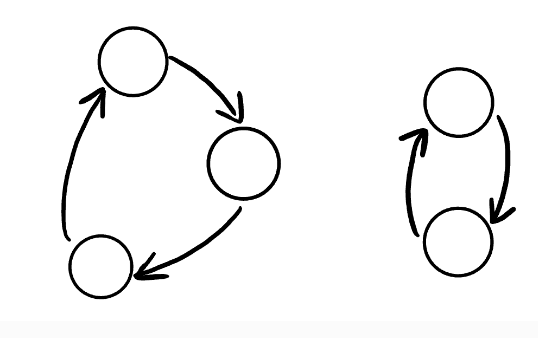

# Class 35 reading notes

#### [HOME](https://cesarderio.github.io/reading-notes/)

## [Implementation: Graphs](https://codefellows.github.io/common_curriculum/data_structures_and_algorithms/Code_401/class-35/resources/graphs.html)

### **Graphs**

A **graph** is a data structure which is non-linear. Graphs hold collections of **vertices** / (*nodes*). These *nodes* can potentially be connected with line segments named **edges**

#### Terminology

**Vertex** - (node) a data object that can have zero or more adjecent vertices.

**Edge** - connection between two nodes.

**Neighbor** - adjacent nodes connected by an edge.

**Degree** - number of edges connected to the vertex.

#### Directed vs Undirected

**Undirected Graph** graph where each edge is undirected or bi-directional. (the undirected graph does not move in any direction).

Node C is connected to Node A, Node E and Node B. There are no “directions” given to point to specific vertices. The connection is bi-directional.

The undirected graph has 6 vertices and 7 undirected edges.

**Vertices/Nodes** = {a,b,c,d,e,f}

**Edges** = {(a,c),(a,d),(b,c),(b,f),(c,e),(d,e),(e,f)}

**Directed Graphs (Digraph)** graph where every edge is directed. A Digraph has direction. Each node is directed at another node with a specific requirement of what node should be referenced next.

The directed graph above has six vertices and eight directed edges

**Vertices** = {a,b,c,d,e,f}

**Edges** = {(a,c),(b,c),(b,f),(c,e),(d,a),(d,e)(e,c)(e,f)}

#### Complete vs Connected vs Disconnected

There are many different types of graphs. This depends on how connected the graphs are to other node/vertices.

The three different types:

* **completed** - when all nodes are connected to all other nodes.

* **connected** - a graph that has all of vertices/nodes have at least one edge.

* **disconnected** - a graph where some vertices may not have edges.

#### Acyclic vs Cyclic

**Acyclic Graph** - a directed graph without **cycles**.

* **cycle** is when a node can be traversed through and potentially end up back at itself.

* A directed acyclic graph is also called a DAG. This can also be represented as what we know as a tree.

**Cyclic Graphs** - a graph that has cycles.

* **cycle** - path of a positive length that starts and ends at the same vertex.

