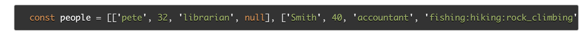
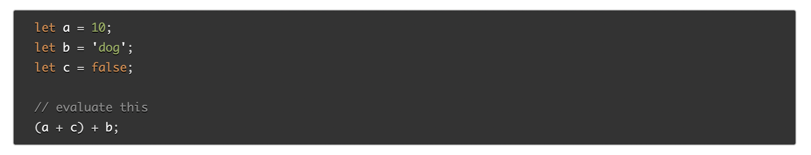

# Class 3 reading notes

#### [HOME](https://cesarderio.github.io/reading-notes/)

## These topics add on to what we have already learned. It goes more in depth to understanding HTML, CSS and JavaScript. These new topics and knowledge will also give us the ability to create more functional and better looking and working websites

## Learn HTML

### **Ordered** and **Unordered** lists

1. When should you use an **unordered list** in your HTML document?

* When you want to have a list of related things without any particular number or order.

2. How do you change the **bullet style** of unordered list items?

* By using the *type* attribute, circle, disc, square.

3. When should you use an **ordered list** vs an **unordered list** in you HTML document?

* Depends on if you want a specific order or hierarchy to your list.

4. Describe two way you can change the numbers on **list items** provided by an **ordered list** ?

* By using the *value* attribute.

## **Learn CSS**

### **The Box Model**

1. Describe the CSS properties of **margin** and **padding** as characters in a story. What is their role in a story titled: **The Box Model**?

* The *margin* is the perimeter guard in charge of the outermost area, from the edges of the full site. The *padding* is the guard inside the *border* wall protecting the content.

2. List and describe the **four** parts of an HTML elements box as referred to by the **box model**.

* The margin is the outermost area of the box, the border is inside the margin surrounding the padding box that holds the content inside of it. They are like nesting dolls, one inside the other.

## **Learn JS**

### **Arrays**. **Operators** and **Expressions**. **Conditionals**. **Loops**

1. What **data types** can you store inside of an **Array**?
 Any kind of *data type* can be stored in side of **Arrays**.

2. Is the **people** array a valid JavaScript array? If so, how can I access the values stored? If not, why?

* Yes it is, you can access the values by using the items' index inside the array(s).

<!--  -->

3. List **five** shorthand operators for assignment in javascript and describe what they do.

* **=** assigns a value, **+=** adds to the value and shows new value, **-+** subtracts from the value and outputs new value, ***=** multiplies and outputs new value, **/=** divides and outputs new value.

4. Read the code below and evaluate the last **expression** and explain what the result would be and why.

* The result would be falsey, the first portion evaluates to false and so does the second portion.

<!--  -->

5. Describe a real world example of when a conditional statement should be used in a JavaScript program.

* It can be used to check for username and password when having users log in to a website such as social media.

6. Give an example of when a **Loop** is useful in JavaScript.

* When you want to repeat code a known or unknown number of times to check conditionals or evaluate to true or false.

## Things I want to know more about
