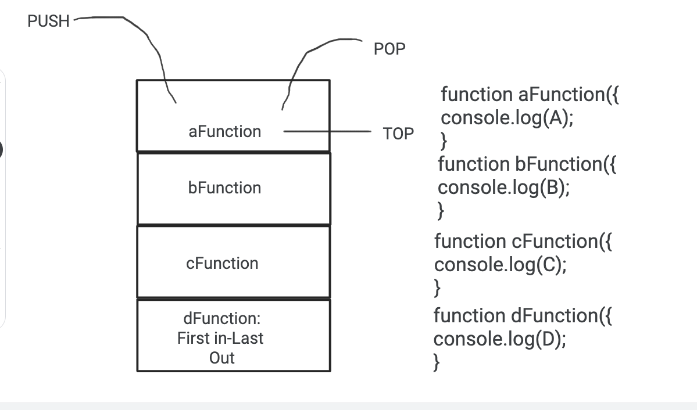

# Class 10 reading notes

#### [HOME](https://cesarderio.github.io/reading-notes/)

We are learning about how Callstacks work and how it runs through and code and functions. We are also learning about errors and debugging to be able to understand better how to work on our code and troubleshoot.

[Understanding the JavaScript Call Stack](https://www.freecodecamp.org/news/understanding-the-javascript-call-stack-861e41ae61d4)

What is a ‘call’?

* A **call** is invoking the function.

How many ‘calls’ can happen at once?

* It executes line by line, invoking one function at a time.

What does LIFO mean?

* **LIFO** stands for **Last In - First Out**

Draw an example of a call stack and the functions that would need to be invoked to generate that call stack.

<!--  -->

What causes a Stack Overflow?

* Stack Overflow is when a recursive function has no exit point, a browser can only hold so much before it times out.

[JavaScript error messages](https://codeburst.io/javascript-error-messages-debugging-d23f84f0ae7c)

What is a ‘reference error’?

* a variable is not declared/set/defined before declaration is made of that variable.

What is a ‘syntax error’?

* This is an error when the syntax is not properly formatted/parsed.

What is a ‘range error’?

* Setting invalid values i.e. negative length on array length.

What is a ‘type error’?

* The type(s) are incompatible, (accessing a property in an indefined type of variable. )

What is a breakpoint?

* A point set in the code for the program to stop at if a set condition is met.

What does the word ‘debugger’ do in your code?

* The debugger runs code step by step to find/check for bugs/errors.

Bookmark and Review

[JavaScript errors reference on MDN](https://developer.mozilla.org/en-US/docs/Web/JavaScript/Reference/Errors)

## Things I want to know more about
